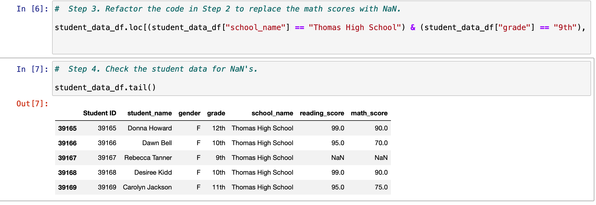
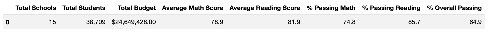
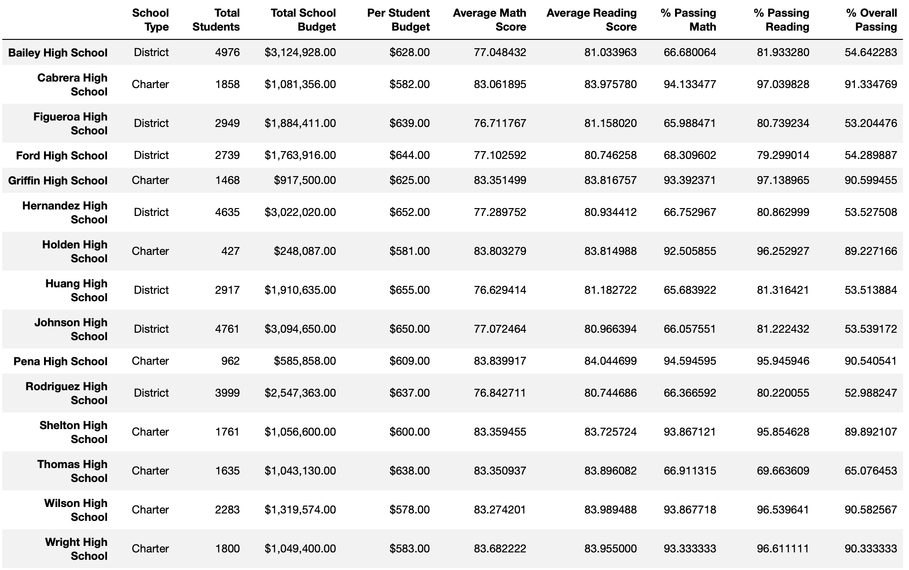
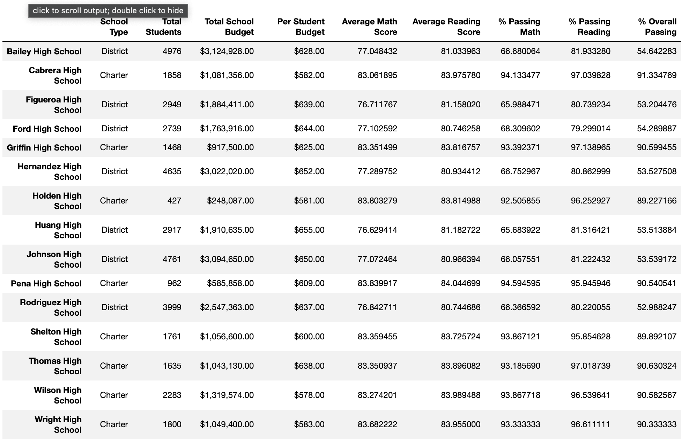

# School_District_Analysis

## Table of Contents
- [1.0 Project Overview](#Project-Overview)
  * 1.1 Purpose
  * 1.2 Resources
- [2.0 Results](#Results)

- [3.0 Summary](#Summary)

- [4.0 Challenges] (#Challenges)

## Project Overview
### 1.1 Purpose
The school board sees that academic dishonesty is occurring and want to remove the ninth graders from the list as their grades have been altered.

 1. Replace ninth graders reading and math scores with NaN
 2. Conduct a school district analysis

### 1.2 Resouces
- Data Source: schools_complete.csv and students_complete.csv
- Software: Python 3.6.1, Jupyter Notebook

## Results
* Replace ninth graders reading and math scores with NaN. 
  
  
  
  
* How is the district summary affected?

 When removing the ninth graders from Thomas High School the school district summary decreased in total student count by 461 students.  The average scores and passing did not change for the overall district scores because the ninth graders was only removed from one high school and not all high schools.
 
Summary District after ninth graders are removed: 

* How is the school summary affected?

   Original:
   
   
   Removed the 9th graders:
   
   
  - Replacing the ninth grader's math and reading scores improves the relative performance compared to other schools. Thomas High School becomes a top performing school for the percentage of students passing math and reading.  
   
  - The percentage of students that passed math and reading significantly increased when removing the ninth graders.  The scores for math went from 66.9% to 93.2% and the reading scored went 69.7% to 97.0%. 
   
   
  - Scores by school spending
    The scores by school spending did not change, as it is based off of per capitia.
    
    `Per Capita = per school budget/per school counts`
    
  - Scores by school size
   There were no changes in the school size, as the 9th graders from Thomas High School were only removed from the total count of students in the district.  The school size is based off of the following calculation
   `school_data_complete_df["school_name"].value_counts()`
   
  - Scores by school type
   The scores by school type was also based off of the type of school and used the passing scores without the ninth graders.  At a school type level the differences were at the 100th decimal place, therefore removing the ninth graders did not impact the results. 
   
   Original:
   [school type](Resource/Type_original.png)
   
   Removed 9th Graders:
   [school type](Resource/type_no_ninth.png)

## Summary

Summarize four major changes in the updated school district analysis after reading and math scores for the ninth grade at Thomas High School have been replaced with NaNs.
 
 1. The passings rate for Math and Reading scores significantly increased. 
 2. The number of students in the district decreased.
 3. The overall passing score increased from 65% to 91%.
 4. Thomas High School became the 2nd highest performing school right after Cabrera High School.

## Challenges

The instructions for setting up the files was very confusing and it was difficult to submit the proper items. I completed the challenge, but I do not believe the proper format is turned with the combination of the code. It could be helpful to incorporate these steps throughout rather than only providing instructions for how the assignment should be submitted at the veyr top. 
